# ESP32 Indoor-Air-Quality monitor based on BME680

## How to use
Create a Firebase account, flash the firmware, provision the board and you are ready to go.

### Software Required
PlatformIO

### Hardware Required
This example should work with ESP32 based development boards.
You can use the kicad design files to replicate the final design.

### How to build PlatformIO based project

1. [Install PlatformIO Core](http://docs.platformio.org/page/core.html)
2. Download [development platform with examples](https://github.com/platformio/platform-espressif32/archive/develop.zip)
3. Extract ZIP archive
4. Run these commands:

```
# Build project
$ pio run

# Upload firmware to specific port
$ pio run --target upload --upload-port /dev/ttyUSB0

# Build specific environment
$ pio run -e esp32dev

# Upload firmware for the specific environment
$ pio run -e esp32dev --target upload

# Clean build files
$ pio run --target clean
```

### Comments
Power consumption is still under improvement. With a battery of 2000mA the expected lifetime is 70.35 hours (approx 3 days). We've detected peeks of 374.87mA during the transmission that probably can't be improved. However the average of 28.428mA may be.

## Media

### IAQ Board
<p align="center">
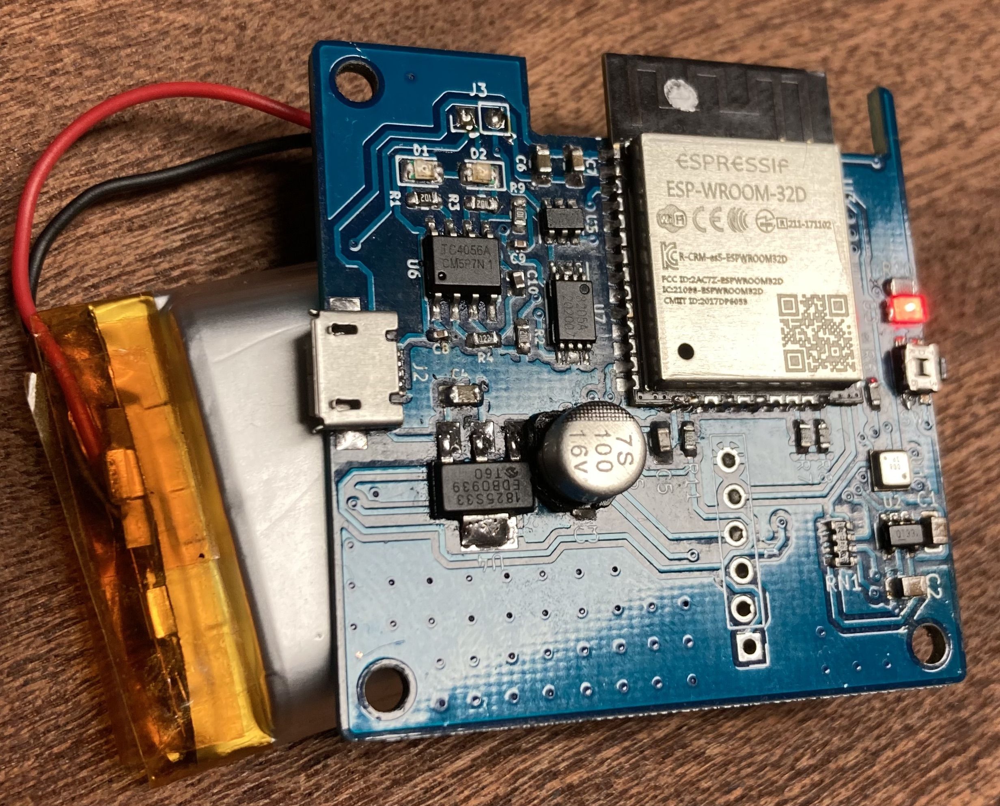
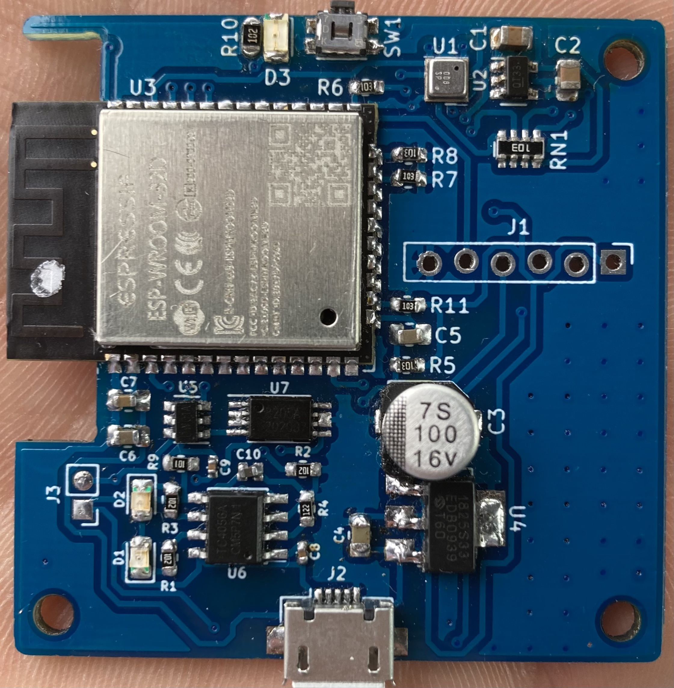
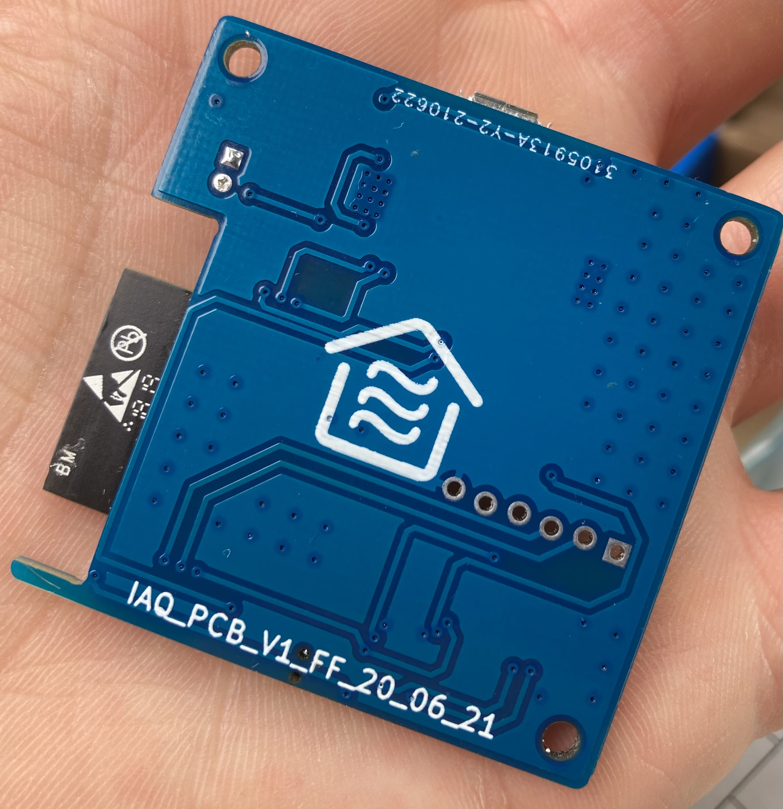
</p>

### IAQ Housing
<p align="center">
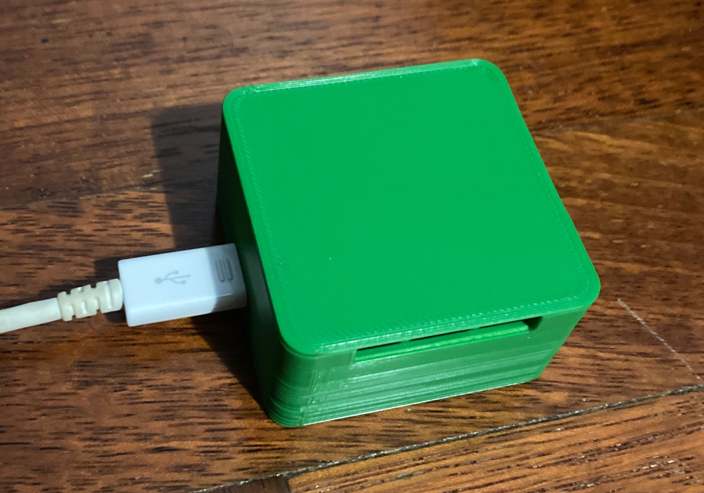
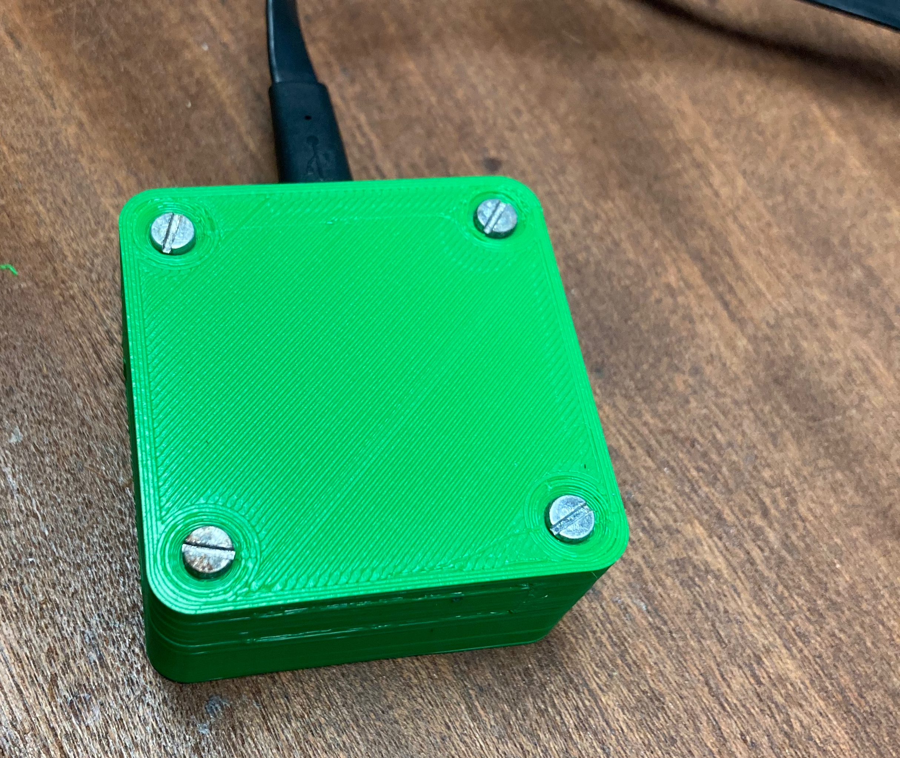</br>
</br>
</br>

</p>

### Dashboard
<p align="center">
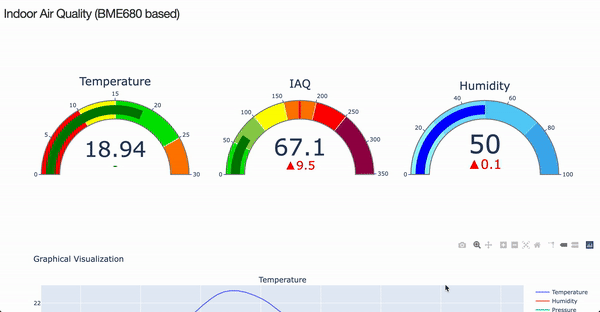
</p>

### Schematics
<p align="center">
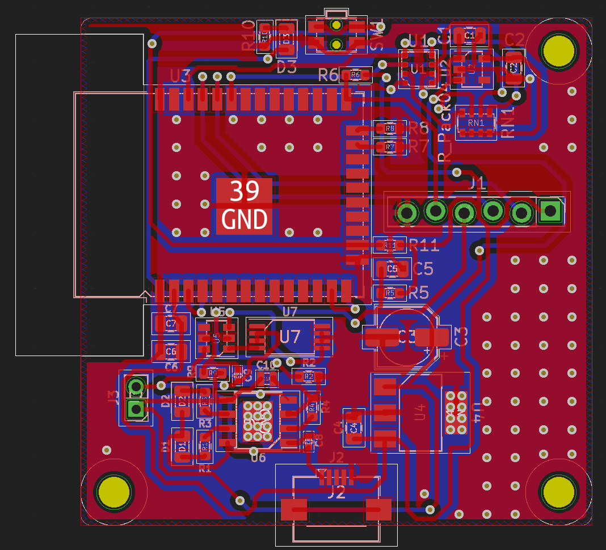</br>
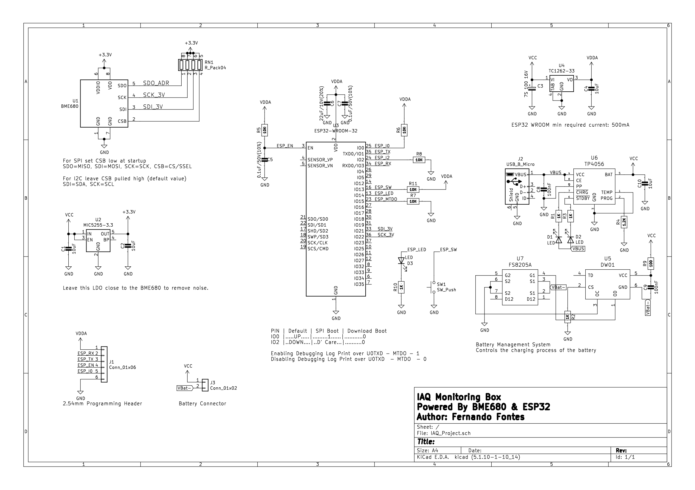
</p>

### Power Consumption
Timestamp in milliseconds (ms).
Current in microampère (µA).
<p align="center">
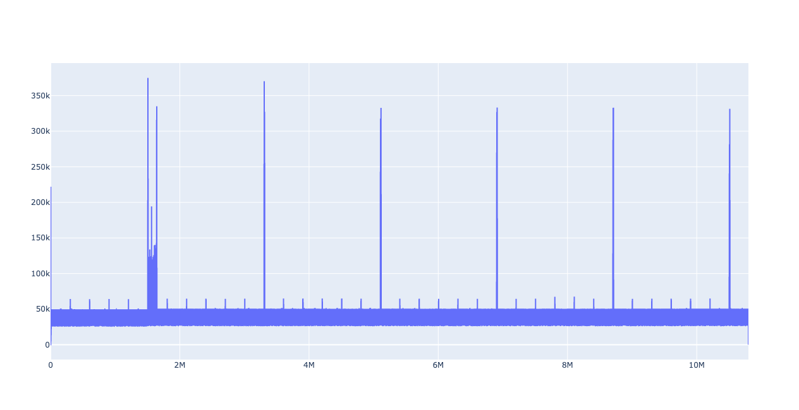</br>
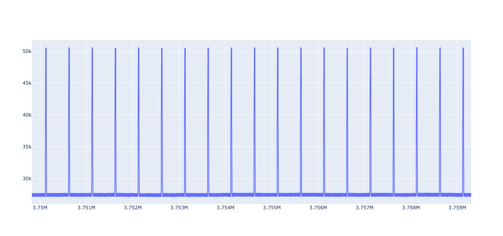</br>
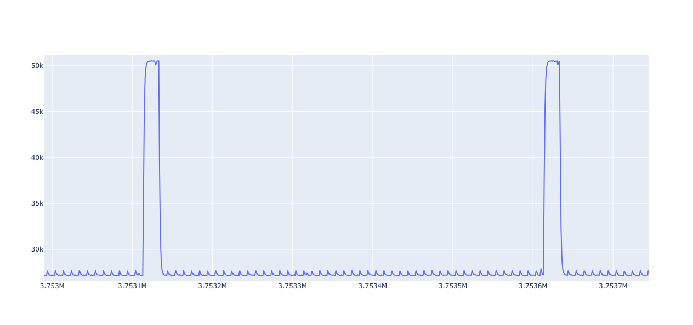
</p>