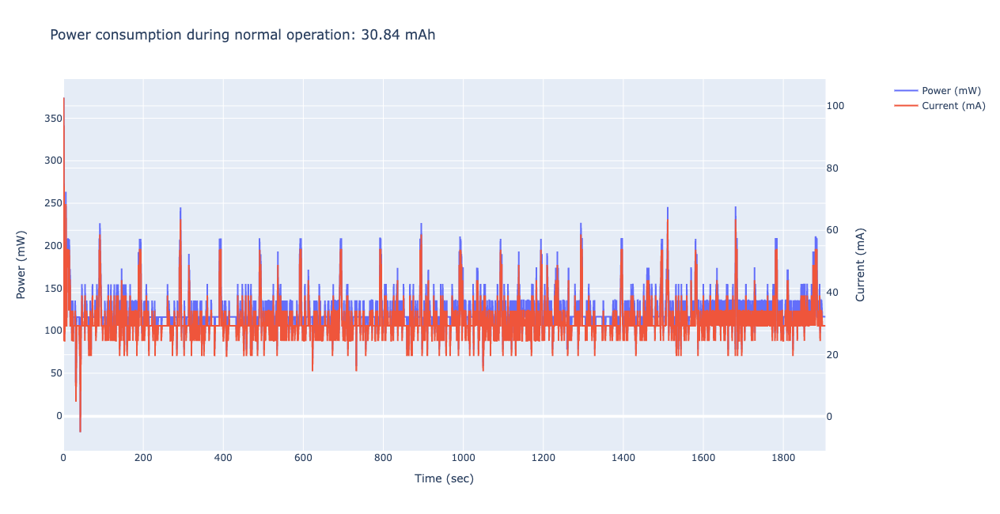
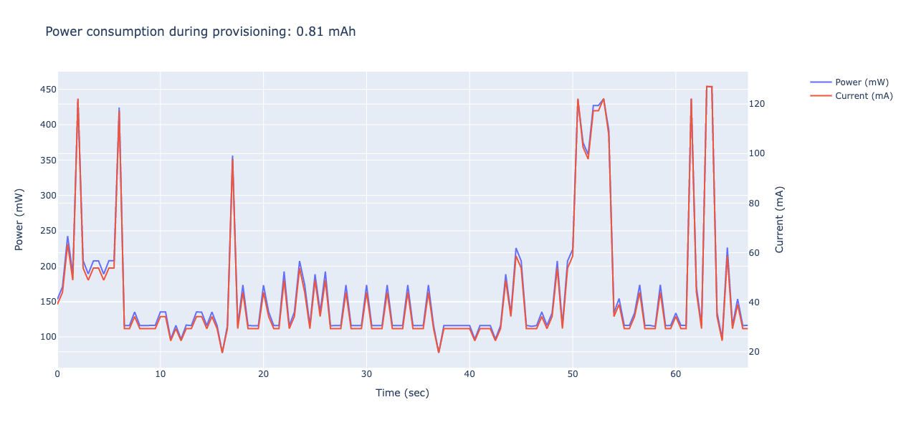

# ESP32 Indoor-Air-Quality monitor based on BME680

## How to use

### Software Required

ESP-IDF

### Hardware Required

This example should be able to run on any commonly available ESP32 development board. However feel free to use the kicad-design-files to replicate the final board.

### Configure the project

Set your firebase configuration in:
```
components/https_post/firebase_conf.h
```

### Build and Flash

Build the project and flash it to the board, then run monitor tool to view serial output:

```
idf.py -p PORT flash monitor
```

(Replace PORT with the name of the serial port to use.)

(To exit the serial monitor, type ``Ctrl-]``.)

See the Getting Started Guide of ESP-IDF to build the project.

## Media

### IAQ Board
<p align="center">


</p>

### Schematics
<p align="center">
</br>

</p>

### Power Consumption
<p align="center">


</p>